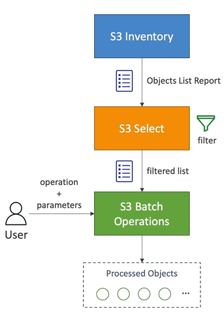

# S3 - Performance

## Baseline Performance

- Amazon S3 automatically scales to high request rates, latency 100-200ms
- Your application can achieve at least 3500 PUT/COPY/POST/DELETE or 5500 GET/HEAD requests per second per prefix in a bucket
- There are no limits to the number of prefixes in a bucket
- Example 1 (object path=>prefix):
  So you get 3500 PUT/COPY/POST/DELETE per second for each of the following prefixes:
    - mybucket/folder1/sub1/file => /folder1/sub1/
    - mybucket/folder1/sub2/file => /folder1/sub2/
- If you spreads prefixes evenly, you get 3500 * 2 prefixes = 7000 requests per second 
    

# S3 - Performance

- Multi-Part upload
  - recommended for files > 100MB, must use for files > 5GB

- S3 Transfer Acceleration
  - Increase transfer speed by transferring file to an AWS edge location which will forward the data to the S3 bucket in the target region

- S3 Byte-Range Fetches
    - Parallelize GETs by requesting specific byte ranges of an object
    - Better resilience in case of failures
    - Can be used to speed up downloads
    - Can be used to retrieve only partial data(for example the head of a file)

    