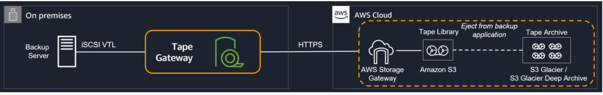

## Storage Gateway - Tape Gateway

- Enables you to replace physical tapes on-premise with virtual tapes in AWS without changing existing backup workflows
- Supports leading backup applications and caches virtual tapes on-premise for low-latency data access
- Can move your virtual tapes archived in Amazon S3 Glacier or S3 Glacier Deep Archive (Note: You can move data into any storage tier)

