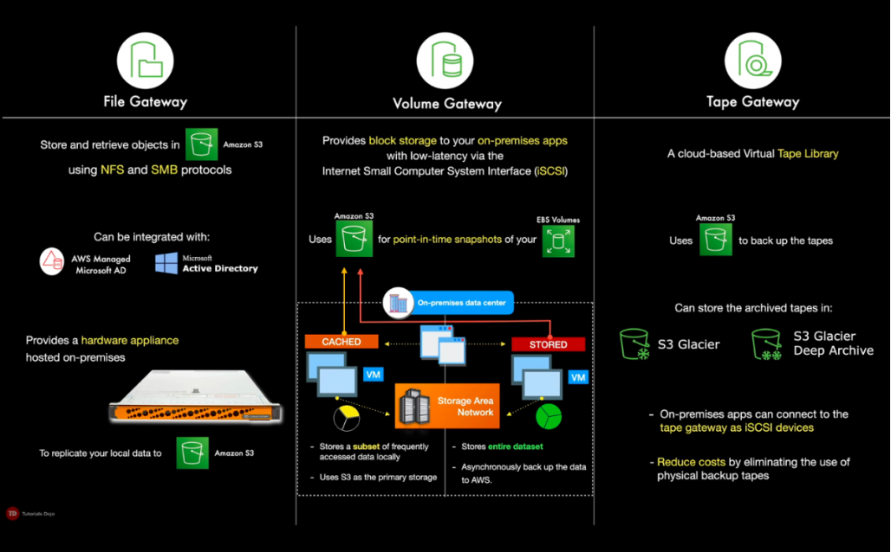

# AWS Storage Gateway

- Enables hybrid cloud storage between on-premises environments and the AWS Cloud
- Integrates on-premise entepries applications and workflows with Amazon's block and object storage services through industry standard storage protocols
- Stores files as native S3 objects, archives virtual tapes in Amazon Glacier, and stores EBS snapshots generated by the Volume gateway with Amazon EBS

## References

https://tutorialsdojo.com/aws-storage-gateway/

https://youtu.be/pNb7xOBJjHE
