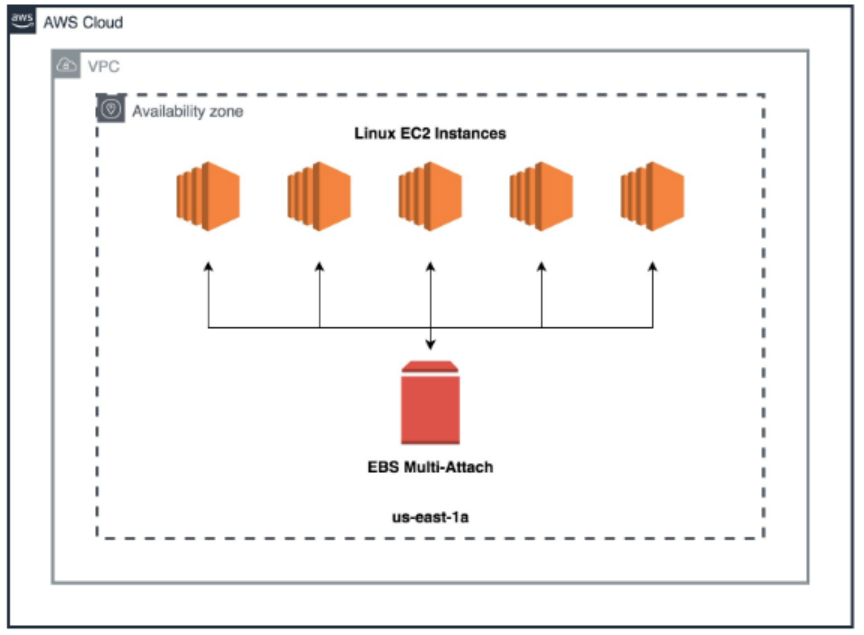

# Amazon EBS Multi-Attached Volumes

- EBS Multi-Attach allows you to attach a single EBS volume to multiple EC2 instances in the same Availability Zone.
- Shared a single EBS volume for up to 16 instances and provide higher availability and durability.
- Supported exclusively on the Nitro system-based instances and Provisioned IOPS SSD (io1 and io2) volumes.
- You can't change the volume type, size, or Provisioned IOPS of a Multi-Attach volume after you create it.

## References

https://tutorialsdojo.com/amazon-ebs-multi-attach/

