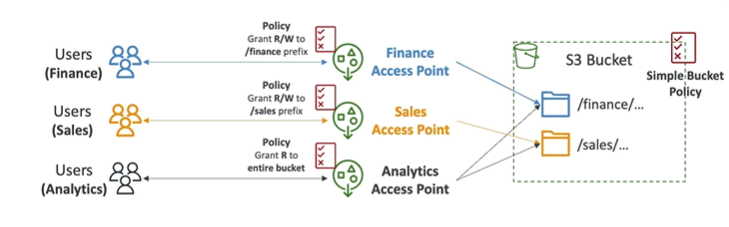

# S3 Access Points

- S3 Access Points are unique hostnames that customers create to enforce distinct permissions and network controls for any request made through the access point.
- Access Points simplify security manage for S3 buckets and shared data sets by removing the need to manage complex block public access settings on individual buckets.

- Each Access point has it own DNS name (Internet Origin or VPC Origin)
- Access Points support VPC endpoints (VPCE) and VPC endpoint policies to allow access only from your VPCs and over private connections.

## VPC Origin

- Access points can be configured to allow access only from a specific VPC.
- You must create a VPC Endpoint (VPCE) to access the Access Point(Gateway or Interface Endpoint)
- The VPC Endpoint Policy must allow access tot he target bucket and Access Point  