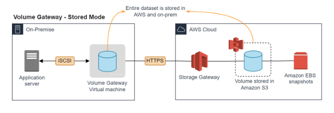
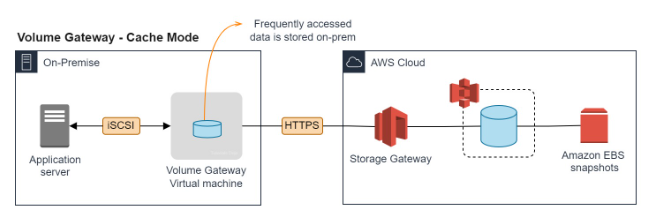
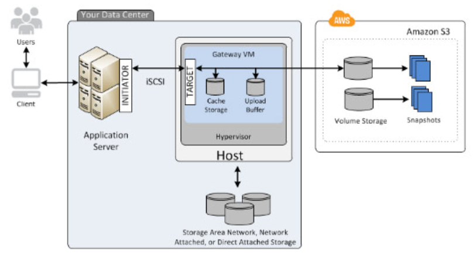
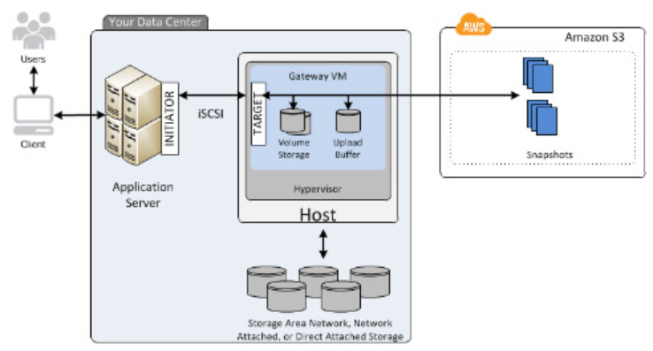

# Storage Gateway - Volume Gateway

Provides cloud-backed storage volumes that you can mount as Internet Small Computer System Interface (iSCSI) devices from your on-premise application servers

Supports the following volume types:
    - Cached Volumes - stores your data in Amazon S3 and retains a copy of frequently accessed data subsets locally
    
    - Stored Volumes - stores your primary data locally, while asynchronously backing up that data to AWS
    

## Volume Gateway - Cached Volumes

- You store volume data in AWS, with a small portion of recently accessed data in the cache on-premises.

## Volume Gateway - Stored Volumes

- You store the entire set of volume data on-premises and store periodic point-in-time backups (snapshots) in AWS.

