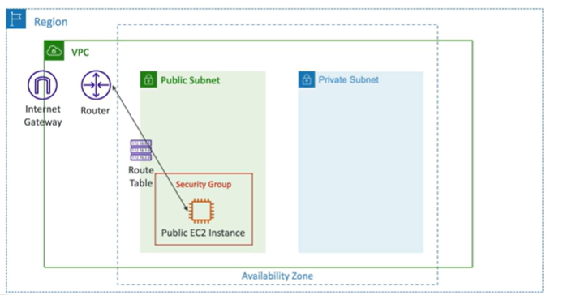

# Internet Gateway (IGW)

- Allow resources within the VPC to connect to the internet
- It scales horizontally and is highly available and redundant
- Must be created separately from the VPC
- One VPC can only be attached to one IGW and vice versa
- IGW on their own do not allow traffic to flow in or out of the VPC
- Route tables must also be edited

