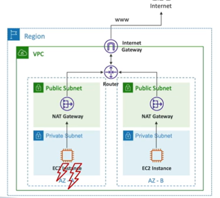

# NAT Gatway

- AWS-managed NAT, high bandwidth, highly available, automatically scaled, and requires no maintenance.
- Performs network address translation for all outgoing traffic from a private subnet, the NAT Gateway's replaces the source IP address with it own IP address and then sends the traffic to the internet gateway.
- Pay per hour of usage and bandwidth
- NAT Gateway is created in a public subnet
- Can't be used by EC2 instances in the same subnet
- NAT Gateway is created in a specific Availability Zone, uses a Elastic IP
- Requires an Internet Gateway (Private Subnet -> NAT Gateway -> Internet Gateway)
- 5 Gbps of bandwidth, can be increased to 100 Gbps
- No security groups to manage/required

# NAT Gateway with High Availability

- NAT Gateway is resilienent within a single Availability Zone
- Must create multiple NAT Gateways in multiple Availability Zones for high availability
- There is no cross-AZ failover for NAT Gateways

