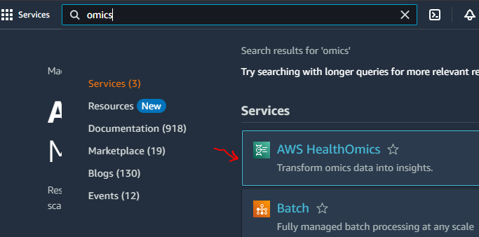
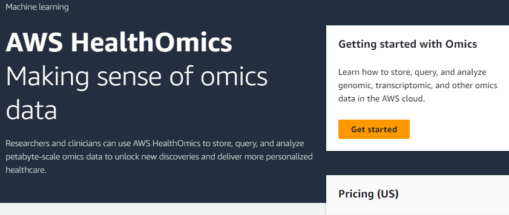
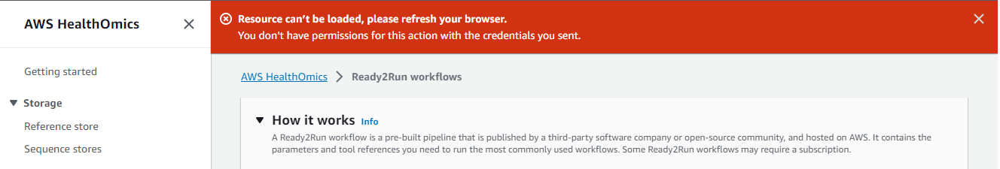
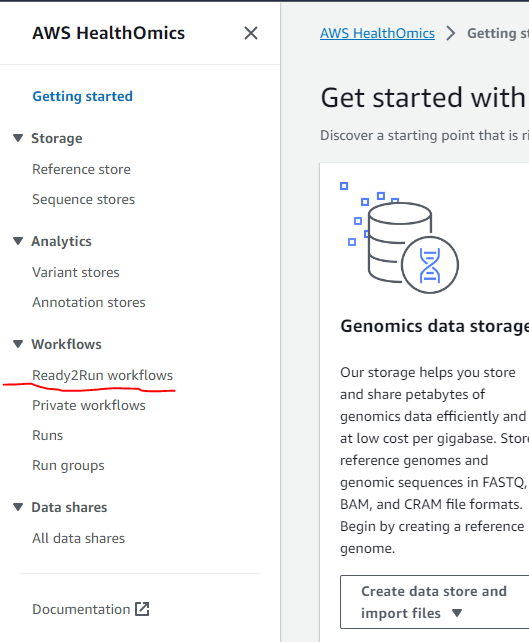
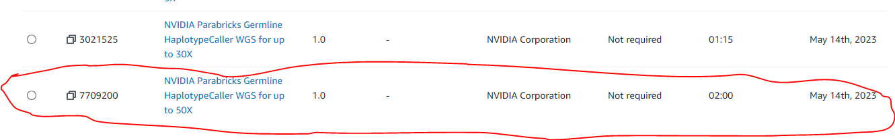

# How to use AWS HealthOmics

## Your AWS Account

You should have been been sent two emails from me 
- The first provides your account name and explains how to login to my AWS sandbox account 
- The second is your temporary password.  The first time you login you will have to change your password.  

## Using AWS Omics Ready2Run Workflows
One logged in you can find the AWS HealthOmics service by typing in "omics" in the search bar.  

Select "AWS HealthOmics" to go to the HealthOmics introduction page

Select "Get started" to go to the main HealthOmics page

At the top of the page you will see a "Resource can't be loaded" error.  I'm not sure what causes this but it is not a problem. 

Select "Ready2Run workflows" to see the list of workflows.  

Find the workflow with Workflow ID "7709200" and Workflow name "NVIDIA Parabricks Germline HaplotypeCaller WGS for up to 50X".  Select the "Create run"

