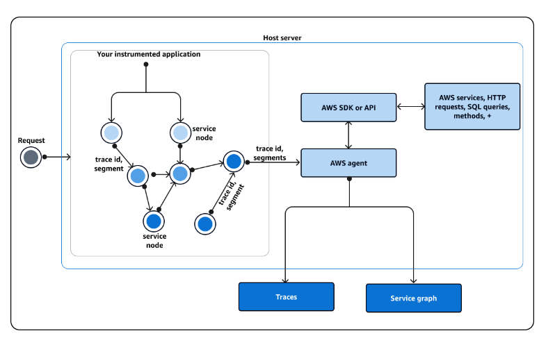

# AWS X-Ray

Trace information about any received responses and calls that an application makes, including the following:

- Downstream AWS resources
- Microservices
- Databases
- Web APIs

## Instrumenting your Application

X-Ray assigns a trace id to any request that your instrumented application receives.  If your application interacts with another component, X-Ray creates a segment.  This segment is associated with the original trace id and tracks the quality of the interaction with that component.

## How X-Ray interacts with your instrumented application

1. After your application serves the request, X-Ray SDK sends trace data to an AWS collector or agent. You choose from 3 agents:
    - AWS Distro for OpenTelemetry Collector
    - Amazon CloudWatch agent
    - X-Ray daemon - A legacy collector that works with X-Ray SDK and X-Ray API. This is included with AWS Elastic Beanstalk.
2. Agent sends the data to a tracing framework that consists of either an AWS API or AWS SDK that is build on top of an API.  The X-Ray API provides access to all X-Ray functionality through the AWS SDK, AWS CLI or directly over HTTPS.
3. (Optional) The tracing framework can interact with other AWS services, HTTP servers, or other methods and queries. Services include EC2, SNS and API Gateway.
4. You can view data in the console about your traces, segments and subsegments in a GUI.
    -  https://console.aws.amazon.com/cloudwatch/ 
    Cloudwatch console - view traces, logs and metrics in one location
    -   https://console.aws.amazon.com/xray/home
    Legacy GUI experience

