# How to deploy a EC2 Instance from the Cisco Catalyst 8000V AMI in the AWS Marketplace

## Overview
- I received a new Sandbox account on December 20 2023
- The sandbox account has been subscribed to the AWS Marketplace Cisco Catalyst 8000V for SD-WAN & Routing BYOL AMI in the Virginia(us-east-1) region
- I can create a EC2 instance from the Cisco 8000V image in the Virginia(us-east-1) region
- TIERS will be hosted in the Ohio (us-east-2) region

## Problem

- The sandbox account has not be subscribed to the AWS Marketplace Cisco Catalyst 8000V for SD-WAN & Routing BYOL AMI in the Ohio(us-east-2) region
- I cannot create a EC2 instance from the Cisco 8000V image in the Ohio(us-east-2) region

## Solution
- Rackspace needs to subscribe me to the Cisco SD-WAN Image in Ohio(us-east-2) so that I can create test the Cisco 8000V in the Ohio(us-east-2) region and the Virginia(us-east-1) region

## Steps to Reproduce the Problem</a>

Goal: Start a EC2 instance from the Cisco 8000V image in Ohio(us-east-2) **(Fail!)**:disappointed:
- Steps:
    - Step 0: Verify you are in the Ohio (us-east-2) region
    - Step 1: Go to the EC2 AMI Catalog list 
    - Step 2: Find the Cisco 8000V for SD-WAN & Routing
        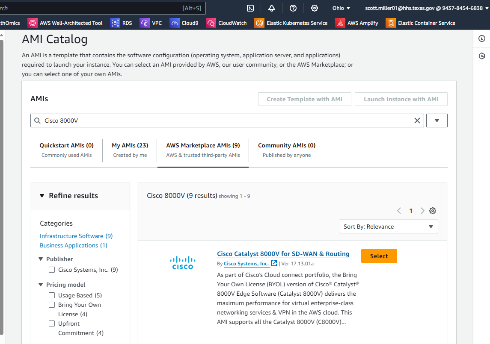
    - Step 3: Click the Select button next to the Cisco 8000V for SD-WAN & Routing BYOL
    - Step 4: You are prompted to Subscribe.  In the Virginia(us-east-1) region I am already subscribed so I don't get this message.  In Ohio(us-east2) I to subscribe. Click Subscribe Now
        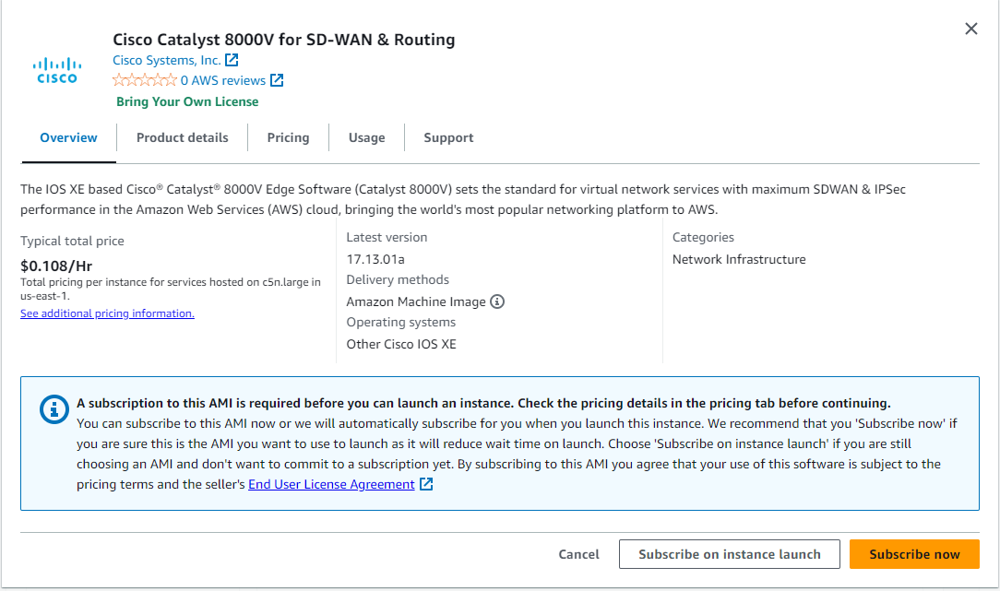
    - Step 5: Click "Launch Instance with AMI"
        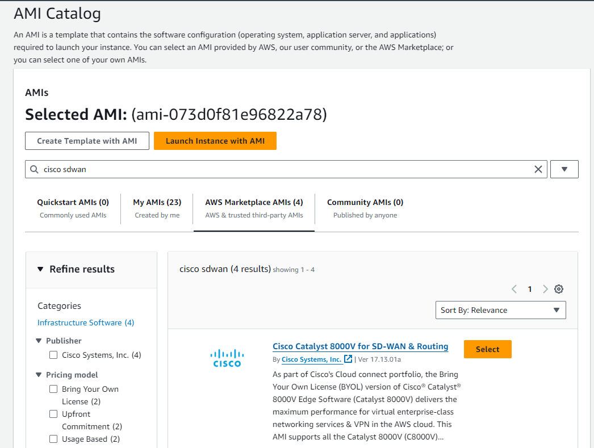
    - Step 6: Fill in the details for the EC2 Instance
        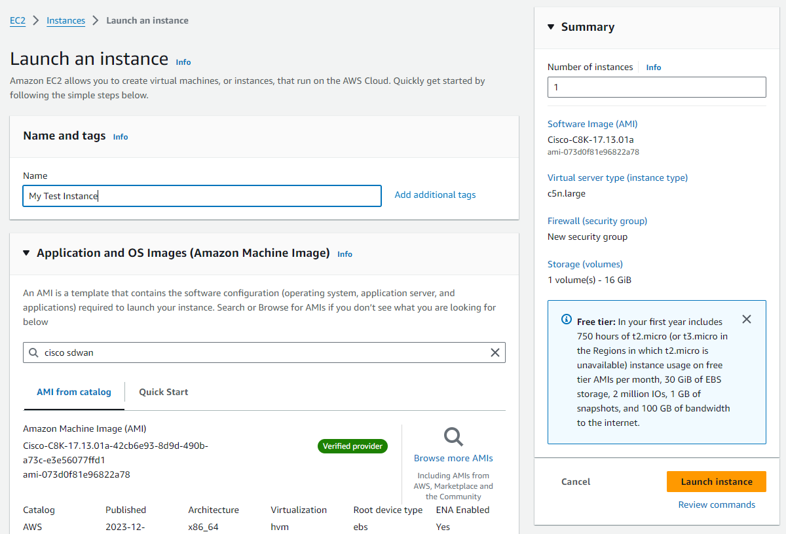
    - Step 7: Click "Launch Instance"
    - Step 8: The instance fails to launch.
        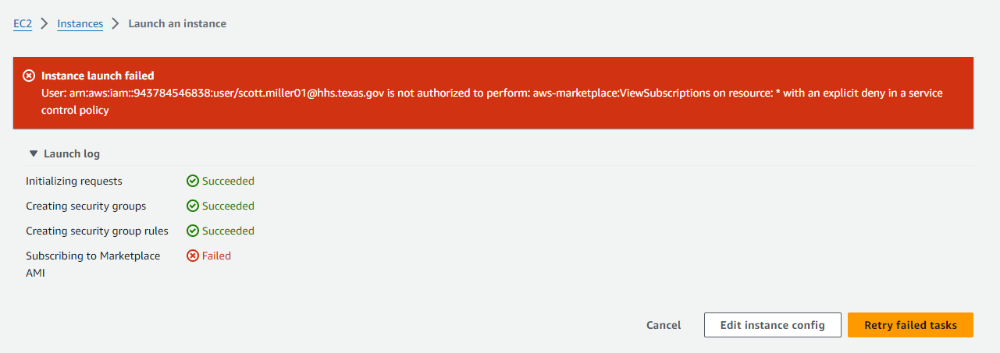

## Steps for a Successful Deployment

Goal: Start a EC2 instance from the Cisco 8000V image in Virginia(us-east-1) **(Success!)**:smiley:
- Steps:
    - Step 0: Verify you are in the Virginia (us-east-1) region 
    - Step 1: Go to the EC2 AMI Catalog list 
    - Step 2: Find the Cisco 8000V for SD-WAN & Routing
        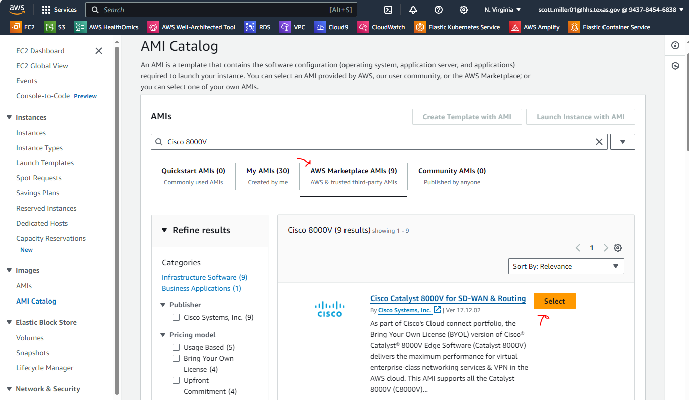
    - Step 3: Click the Select button next to the Cisco 8000V for SD-WAN & Routing
        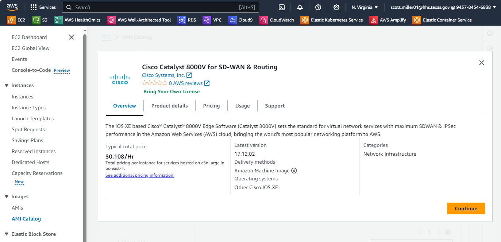
    - Step 4: Click Continue
    - Step 5: Click "Launch Instance with AMI"
        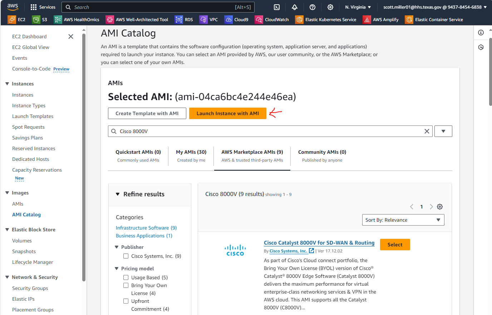
    - Step 6: Fill in the details for the EC2 Instance
        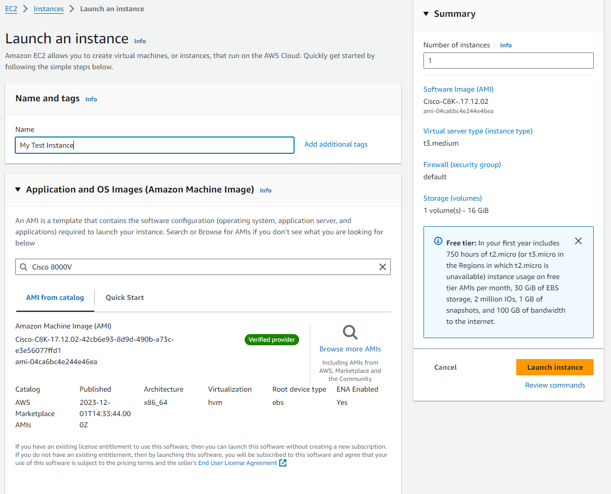
    - Step 7: Click "Launch Instance"
    - Step 8: Wait for your Instance to launch
        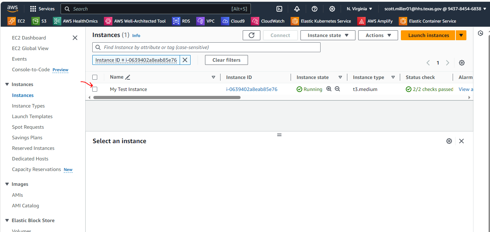

Goal: Access the AWS Marketplace Directly to get access to the AMI  **(Fail!)**:disappointed:
- Steps:
    - Step 1: Go to the AWS Marketplace
        - Error:  Error retrieving subscriptions
        - Reason: Appears to be a Service Control Policy at the Organizational Level. 
    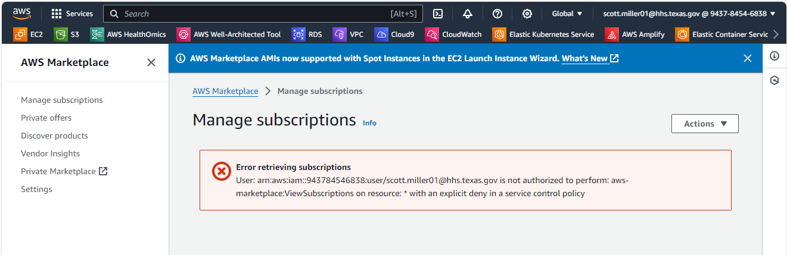

   

