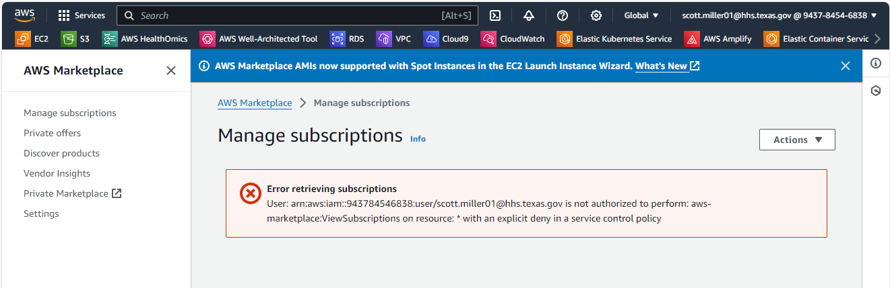
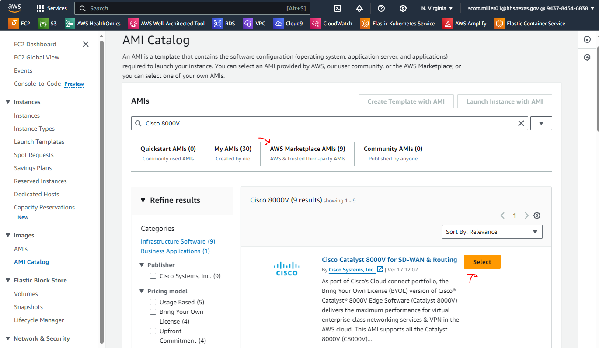
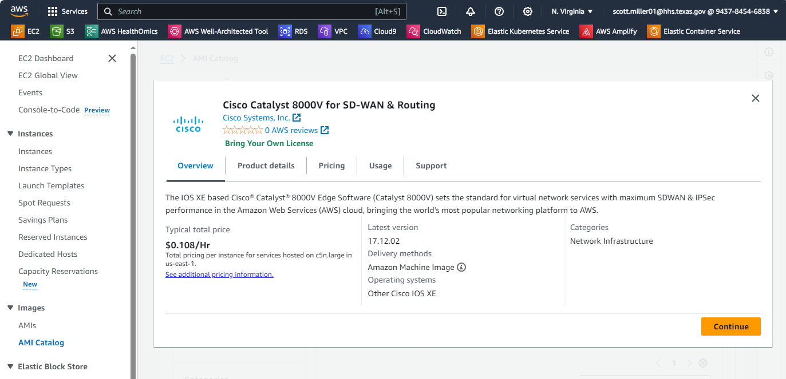
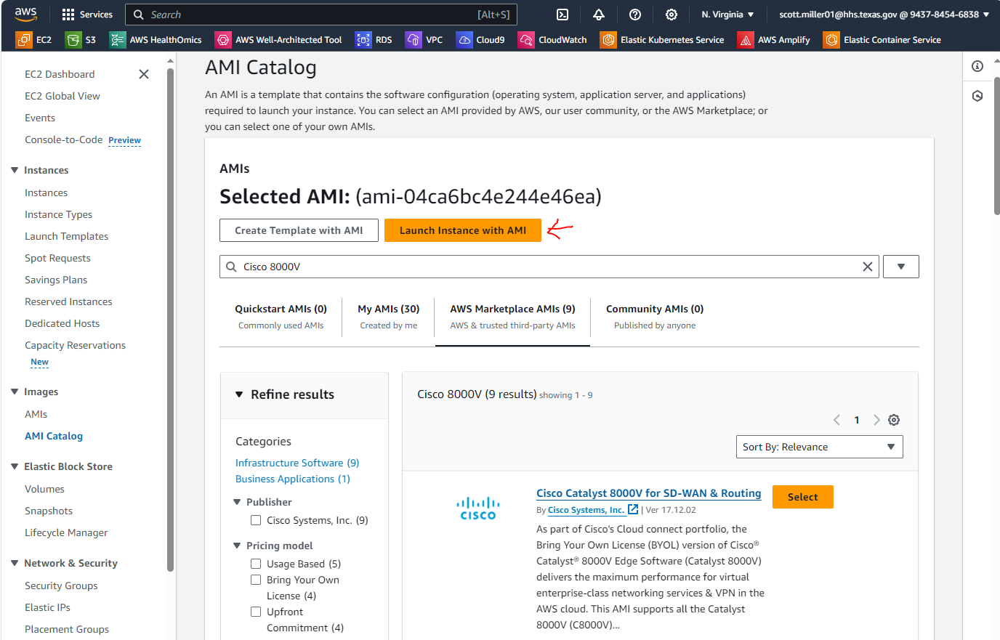
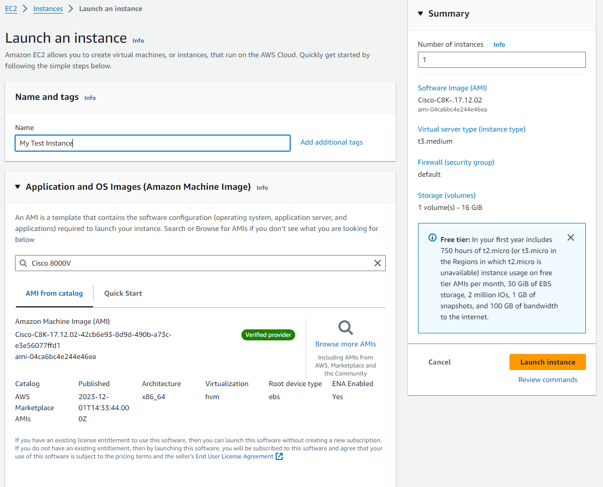
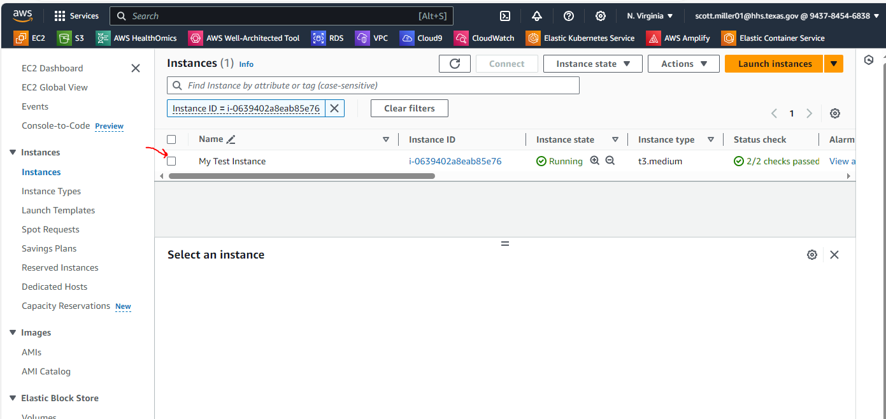

# How to deploy a EC2 Instance using the Cisco Catalyst 8000V for SD-WAN & Routing AMI from the AWS Marketplace

- I received a new Sandbox account on 2023-12-20.   
- I was able to start the EC2 instance with the Cisco Catalyst 8000V for SD-WAN & Routing from the AMI Catalog

## Steps to deploy

Goal: Access the AWS Marketplace Directly to get access to the AMI  **(Fail!)**:disappointed:
- Steps:
    - Step 1: Go to the AWS Marketplace
        - Error:  Error retrieving subscriptions
        - Reason: Appears to be a Service Control Policy at the Organizational Level. 
    

Goal: Try to access the AMI thorough the AMI Catalog **(Success!)**:smiley:
- Steps:
    - Step 1: Go to the EC2 AMI Catalog list 
    - Step 2: Find the Cisco 8000V for SD-WAN & Routing
    
    - Step 3: Click the Select button next to the Cisco 8000V for SD-WAN & Routing
    
    - Step 4: Click Continue
    - Step 5: Click "Launch Instance with AMI"
    
    - Step 6: Fill in the details for the EC2 Instance
    
    - Step 7: Click "Launch Instance"
    - Step 8: Wait for your Instance to launch
    

   

